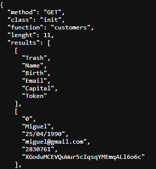
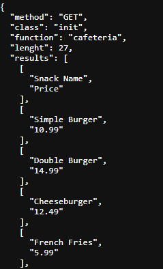

<div align="center">

# Learning API in PHP

## Overview

</div>

### Extensions

`extension_dir = "ext"`
`extension=curl`

### Find results by tables .CSV

- This API provides responses in JSON format based on CSV files stored in the `api/ folder`. Requests are made from the application located in the `app/ folder`.

```
root/
 |-- app/               # Client
 |-- api/               # API
```

### Example in [Index.php](./index.php)
```php
<?php

require_once(dirname(__FILE__) . '/config/config.php');
require_once(dirname(__FILE__) . '/app/index.php');

header("Content-Type:application/json");

echo api_request(/* class */'init', /* function */'customers', /* method */'GET', /* variables */[], /* user */'admin', /* pass */'password123');
die(1);

?>
```

### Results

| Customers                        | Cafeteria                      |
| :------------------------------- | -----------------------------: |
|  | |  |
